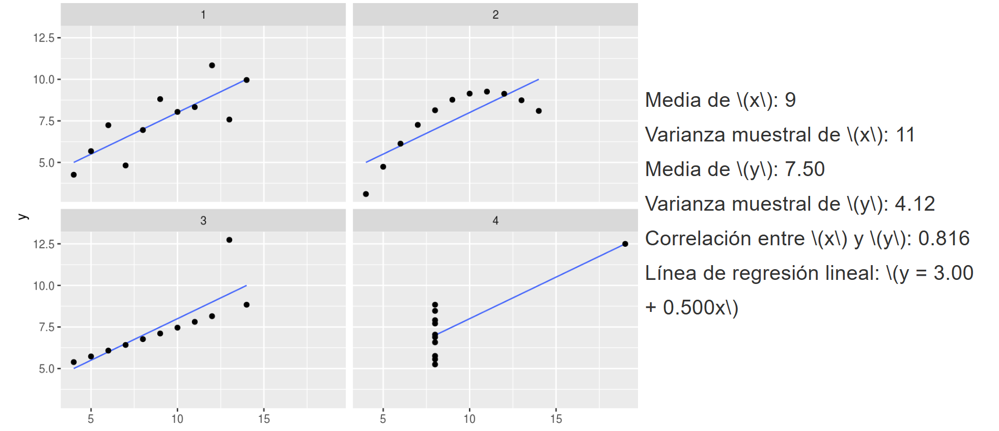

# Anscombe

Práctica 1 - Mineria de datos

# Universidad Politécnica Salesiana

**Carrera:** Computación  
**Periodo:** 2025-2025  
**Estudiante:** Jairo Salazar

---

## Introducción teórica al Cuarteto de Anscombe

> *"Un gráfico simple dice más que mil números"*  
> — John Tukey

El Cuarteto de Anscombe nos enseña algo único: los números pueden engañarnos si los miramos a simple vista. En el ejemplo que presenta, se observa que aunque cuatro conjuntos de datos tengan la misma media, correlación e incluso la misma fórmula de regresión, sus gráficos pueden ser totalmente distintos.

Como conclusión, si solo confiamos en cálculos y no observamos los gráficos, podemos ser fácilmente engañados. Por esta razón, es fundamental **graficar los datos** y no asumir que los resultados numéricos representan fielmente la realidad.

**Fuente:** [Introducción a la visualización](https://tereom.github.io/est-computacional-2018/introducciona-a-visualizacion.html)

